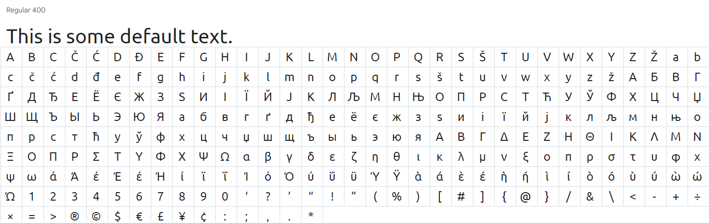

# STAKEHOLDERS
## Customers - 
+ Product info: this is a website for selling mobile devices i.e. phones.
+ It needs to be easily accessible i.e. clear colour schemes for people with visual impairments.
+ Must be a simple layout so not to confuse viewers trying to find a product.
+ Must be quick to load such as using sprites instead of whole images, and only using elements where necessary. 
## Owners - 
+ Needs to be visually appealing to catch the attention of viewers.
+ Must be a professioanl style layout such as no goofy images or text styles.
+ Must be finacially viable and generate an income.
+ Must be cheap to operate (running costs must be lower than profit generated)

## Developers/Me - 
+ Must be well documented, show what has been done.
+ Must be maintainable.
+ Must be easy to test, make a list of what needs testing.
+ Must have design standards, dont cheap out on specific sections.
+ Must be fast to load.

#

# WEBSITE REQUIREMENTS

My website is aimed for people who are looking for phone(s), and accessories.

+ The layout needs to be fast and responsive
+ All the links need to be functional
+ Website needs to be load for 2 seconds
+ Simple and understandable navigation

#

# FILE STRUCTURE

#

# COLOUR SCHEMES

## DESIGN #1

## HEX CODES - 
+ .color-primary-0 { color: #69EF11 }
+ .color-primary-1 { color: #A0F569 }
+ .color-primary-2 { color: #84F23C }
+ .color-primary-3 { color: #5CEA00 }
+ .color-primary-4 { color: #49BA00 }

+ .color-complement-0 { color: #39B9CB }
+ .color-complement-1 { color: #148190 }
+ .color-complement-2 { color: #259CAD }
+ .color-complement-3 { color: #53CFE0 }
+ .color-complement-4 { color: #73E0EF }

## DESIGN #2

## HEX CODES -
+ .color-primary-0 { color: #413E4B }
+ .color-primary-1 { color: #8C7BC3 }
+ .color-primary-2 { color: #322362 }
+ .color-primary-3 { color: #3B07E0 }
+ .color-primary-4 { color: #461BCF }

+ .color-complement-0 { color: #7345EC }
+ .color-complement-1 { color: #3508AC }
+ .color-complement-2 { color: #1D0756 }
+ .color-complement-3 { color: #9089A1 }
+ .color-complement-4 { color: #1B1628 }

### Design #1 is based of 'A Tropical Forest' theme, same with Design #2 has been based of 'Halloween and Nightmare' theme.
#
## FINAL DECISION -
### Reason for choosing Design #1 is that it has a wider range of contrast, plus it fits with the logo, and the text (the text is going be *black* colour, so it will be easier to see and read), plus it was *kind of* confirmed by a peer who gave the statement told that the Design #1 is giving him vibe, then Design #2, and Design #1 is useful for people with colour blindess, because they can see the colours that Design #1 is provoding.

## PEERS STATEMENT -
### Adam : i quite like design 1 as that to me suits the vibe of the website more then design 2

#

# WEBSITE LAYOUT

## DESIGN #1

## DESIGN #2

+ ### For Design #1 I decided to use grid layout, on the left side there's going be a phone image, and with it *small* information about phone, then on the right side there's going be another grid layout for each boxes there's going be phone images, and the prices, plus a *gif* banner. At the bottom there's going be 'About us' text and hyperlinks, then at very bottom, left side there's going be copyright text. At the top, left side there's going be company logo.
+ ### For Design #2 I decided to use grid layout, on the left side there's going be carousel and inside there going be bunch of phones images with the hyperlinks, then on the right side there's going be another grid layout, but this time it's going be images of phone brands with the hyperlinks. At the bottom, left side "Abut us" with a text and hyperlinks, then at right side the regular banner, at the very bottom left side copyright text. A the top , middle there's going be company logo.

#

## FINAL DECISION
### Reason of choosing Design #1 is that fits with my requirements, and for people who going to see it, cause it easier to find everything, plus each of those phones images are going be linked, so no need to research the phone, then Design #2 it has a lot of trouble making, and it will be hard to use for people who will seeing it.

#

## STORYBOARD

### MAIN PAGE -

## PHONE PAGE - 

#

# TYPOGRAPHY

## Font Design #1
### UBUNTU (Regular 400)

## Font Design #2
### ROBOTO SLAB (Light 300)

## FINAL DECISION
### Reason of choosing Font Design #1 is that I used to seeing this font in every single sites, shops, and in the games, it has similar with the default font text, but what's the difference from default to "UBUNTU" is that "f", "e", "d" and "a" has been arounded and understandable.

#

# LOGO DESIGN

### This logo has been made by myself by using photoshop.

#

# ALTERNATIVE DESIGN

### For alternative design, I will be more less creative, but still I will make new design of colour scheme, I will use Design #2 of Website Layout section, and I will use the same logo, but in the different colour (The colour will be similar to new colour scheme desgin).

## COLOUR SCHEME

HEX CODES:
+ .color-primary-0 { color: #BB8438 }
+ .color-primary-1 { color: #FF9400 }
+ .color-primary-2 { color: #FFB754 }
+ .color-primary-3 { color: #C67300 }
+ .color-primary-4 { color: #8C5100 }

+ .color-complement-0 { color: #C8B929 }
+ .color-complement-1 { color: #A79800 }
+ .color-complement-2 { color: #FFE800 }
+ .color-complement-3 { color: #FFF058 }
+ .color-complement-4 { color: #FAEF81 }

### I made that colour-scheme as my alternative is because it's based of Egypt theme, and I like bright colours, so that's why I used brown and yellow colours. #FF9400 colour I will use for my Top bar & Bottom bar, #FFE800 I will use that colour as for my background, #BB8438 colour I will use for my box in grid layout, then #FAEF81 colour I will use for my other box in the left side, and 3 of the boxes that contian in grid layout. At very bottom bar I will use #C67300 colour.

#

## WEBSITE LAYOUT

### Non-Coloured

### Coloured

#

# LOGO

#

# NAVIGATION

### How it works - 
Y - Yes (Navigation works/available)

N- No (Navigation not working/available)

For example - If you want to go to "Twitter" from "Phone 1" the navigation won't work, but if you wll go from "Home" to "Twitter" the navigation it will work.

| Navigation "FROM" - "TO" | Home | Phone 1 | Phone 2 | Phone 3 | Phone 4 | Phone 5 | Phone 6 | Phone 7 | Twitter | Instagram | Facebook |
|:------------------------:|------|---------|---------|---------|---------|---------|---------|---------|---------|-----------|----------|
|           Home           |   Y  |    Y    |    Y    |    Y    |    Y    |    Y    |    Y    |    Y    |    Y    |     Y     |     Y    |
|          Phone 1         |   Y  |    Y    |    N    |    N    |    N    |    N    |    N    |    N    |    N    |     N     |     N    |
|          Phone 2         |   Y  |    N    |    Y    |    N    |    N    |    N    |    N    |    N    |    N    |     N     |     N    |
|          Phone 3         |   Y  |    N    |    N    |    Y    |    N    |    N    |    N    |    N    |    N    |     N     |     N    |
|          Phone 4         |   Y  |    N    |    N    |    N    |    Y    |    N    |    N    |    N    |    N    |     N     |     N    |
|          Phone 5         |   Y  |    N    |    N    |    N    |    N    |    Y    |    N    |    N    |    N    |     N     |     N    |
|          Phone 6         |   Y  |    N    |    N    |    N    |    N    |    N    |    Y    |    N    |    N    |     N     |     N    |
|          Phone 7         |   Y  |    N    |    N    |    N    |    N    |    N    |    N    |    Y    |    N    |     N     |     N    |
|          Twitter         |   Y  |    N    |    N    |    N    |    N    |    N    |    N    |    N    |    Y    |     N     |     N    |
|         Instagram        |   Y  |    N    |    N    |    N    |    N    |    N    |    N    |    N    |    N    |     Y     |     N    |
|         Facebook         |   Y  |    N    |    N    |    N    |    N    |    N    |    N    |    N    |    N    |     N     |     Y    |

#

# SOURCE LINKS

|                 SOURCE                |                     |
|:-------------------------------------:|---------------------|
|   Alternative-Colour-Website-Design   | Made from Photoshop |
|           Alternative-Design          | Made from Photoshop |
|      Colour-Phones-Website-Design     | Made from Photoshop |
|         Colour-Website-Design         | Made from Photoshop |
|             FileStructure             |   Used PowerShell   |
|             Font-Design-1             | Made from Photoshop |
|             Font-Design-2             | Made from Photoshop |
|        Logo-Alternative-Design        | Made from Photoshop |
|             Logo-Design-1             | Made from Photoshop |
| Non-Colour-Alternative-Website-Design | Made from Photoshop |
|    Non-Colour-Phones-Website-Design   | Made from Photoshop |
| Non-Colour-Website-Design             | Made from Photoshop |
| One-Design                            | Made from Photoshop |
| Two-Design                            | Made from Photoshop |
|        Apple Iphone 13 Pro Max        | https://www.apple.com/uk/iphone-13-pro/?afid=p238%7Cs-dc_mtid_20925ukn39931_pcrid_601318486319_pgrid_135548529802_&cid=wwa-uk-kwgo-iphone-slid---productid--Brand-iPhone13ProMax-- |
|             Facebook Icon            | Aiden has made the icon and sended in teams for us to use it for free |
| FlashShell Banner | https://www.rahmansdeal.com/flash-sale/ |
|    Google Pixel 4A 5G   | https://www.amazon.co.uk/Google-Android-Mobile-Adaptive-Battery-Just-Black/dp/B08JLW6VK8 |
| Huawei Y7 Pro             | https://www.gsmarena.com/huawei_y7_pro_(2019)-9500.php |
| Microsoft Surface Duo                           | https://www.microsoft.com/en-us/surface/devices/surface-duo#overview |
| Nokia 8.3 5G                            | https://www.nokia.com/phones/en_gb/nokia-8-3-5g-promo |
| Samsung Galaxy A50 | https://www.samsung.com/uk/business/smartphones/galaxy-a50-enterprise-edition/sm-a505fzksu07/ |
|    Samsung S22 Ultra   | https://www.samsung.com/uk/smartphones/galaxy-s22-ultra/buy/?modelCode=SM-S908BZKDEUB&cid=UK_PPC_4586843643_FF~Eval:Brand%2BProd_Smartphones-Galaxy-S22-Ultra_KS~BAP_BS~IM_PR~SMART_SB~A+SERIES_OB~SALES_FS~LHQ_AI~N_MT~none_CA~n/a&gclid=EAIaIQobChMIwrmO9ffe-AIVDK7ICh1MxgoSEAAYASAAEgIT8_D_BwE&gclsrc=aw.ds |
| SnapChat Icon             | Aiden has made the icon and sended in teams for us to use it for free |
| Twitter Icon                            | Aiden has made the icon and sended in teams for us to use it for free |

#

# TEST PLAN

|                       TEST PLAN                      |                                                                                    |
|:----------------------------------------------------:|------------------------------------------------------------------------------------|
| Make sure if the YouTube video is working in website |          I went to my website and clicked the YouTube video and it works.          |
|      Make sure if navigation works in each pages     | The navigation works for about half a second, and functions it works as a intended |
|  Make sure that in other browsers website will work  |                     I checked in FireFox browser, and it works.                    |
|   Make sure that the images are working in website   |        I checked in 2 different browser, and it works, and it loads instant.       |
|       Make sure that CSS is working in website       |              Yes it loads as intended, and loads within half a second.             |
|   Make sure if the hyperlinks goes in correct place  |                       Yes the hyperlinks go to correct place.                      |

#

# FINISHED PRODUCT

+ Grid Layout is added on right boxes
+ 6-7 phone added
+ 1 YouTube Video is added
+ In each page information has been added
+ Contact information is added

#

# THIRD-PARTYING REVIEW OF FINISHED PRODUCT

## Aiden
The phone pages look really good, could use the edges being bezeled (rounded).
The phone sites could have a logo button to go back instead of a text link. Some phones could be fixed as the text changes and not continues. Some phones are missing text and information. Overall, looks really nice, simple layout and colours go well. Very easy to find a phone of liking.
## Ashley
its really nice. You have a nice selection of phones and you have their prices tags specs and everything. But I would reccomend you to add a buy button on each phone page. You have a nice logo in a nice colour. I like the colours on the website but because it matches some of the phones on the front page. I think it would look better if you added more context on the pages with the individual phones but apart from that its nice.
## daine
the design looks very good, good use of images and nice ideas for the phone pages could use a buy button but its still a good design, everything fuctions perfectly. overall a briliant peice of work.

## ALL FEEDBACK LISTED

+ Add logo button, instead of a text link (It will be added in the new version)
+ Missing text and information on some phones pages (It will be added in the new version)
+  Add buy button (It will be added in the new version)

#

# EVALUATE

I have reviewed my own website and it suitable to people who's looking for phones or accessories for their phones, and it's colourful that's good for people who has colour blindness, plus some phones having a lot of information about it.

